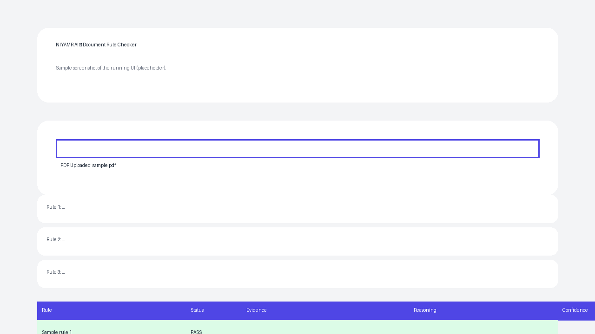
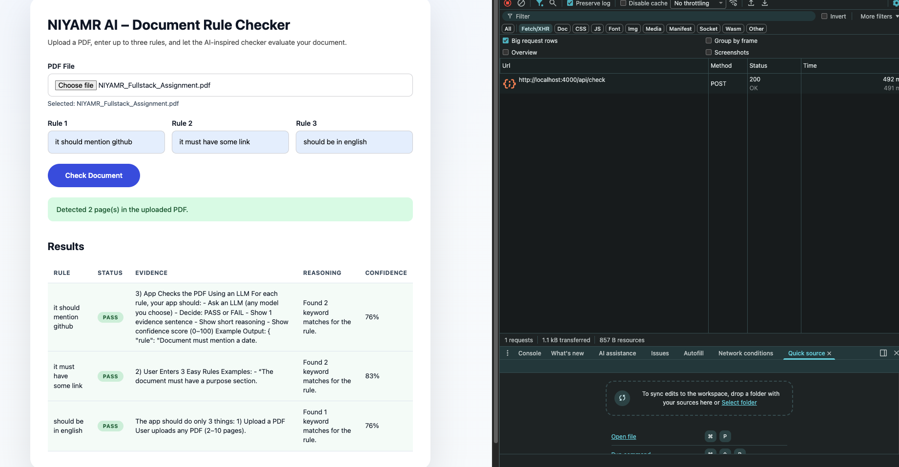

# NIYAMR AI – Document Rule Checker

A super-simple full-stack assignment that lets users upload a PDF, enter three natural-language rules, and run a lightweight LLM-inspired evaluation to surface pass/fail decisions, evidence, reasoning, and confidence.

## Project structure

```
.
├── backend   # Node.js + Express API (PDF parsing + rule evaluation)
├── frontend  # React + Vite single-page app
└── docs      # Screenshot(s) and supporting assets
```

## Features

- Upload 2–10 page PDFs (10 MB max) via the frontend; files are streamed to the API with Multer memory storage.
- Extract PDF text on the backend using `pdf-parse` and run a simple heuristic “LLM” evaluator that searches for rule-relevant sentences.
- Return per-rule summaries containing status, evidence, reasoning, and a simulated confidence score.
- Display results in a responsive React UI with inline validation/errors.

## Backend setup

```bash
cd backend
npm install
npm run dev
```

- Runs on `http://localhost:4000` by default.
- `.env`:
  - `PORT=5000` (optional)
  - `GEMINI_API_KEY=<your key>` (required for real LLM analysis)
  - `GEMINI_MODEL=gemini-1.0-pro-latest` (optional override)

## Frontend setup

```bash
cd frontend
npm install
npm run dev
```

- Defaults to Vite’s dev server at `http://localhost:5173`.
- Configure `VITE_API_URL` in `frontend/.env` if your backend runs on a non-default URL.

## Screenshot



Additional captured UI:



> The provided screenshot illustrates the shipped UI layout. Capture a live screenshot after running `npm run dev` in both folders to satisfy the final deliverable guidelines.

## API reference

`POST /api/check`

- **Body**: `multipart/form-data` containing `pdf` (file) and `rules` (JSON array of rule strings).
- **Response**:
  ```json
  {
    "pages": 4,
    "results": [
      {
        "rule": "Document must mention a date.",
        "status": "pass",
        "evidence": "Published on March 2, 2024.",
        "reasoning": "Found 2 keyword matches for the rule.",
        "confidence": 84
      }
    ]
  }
  ```

## Testing checklist

- [ ] Upload a small PDF (<=10 MB) and confirm page count appears.
- [ ] Provide at least one rule; submit and verify table renders results.
- [ ] Disconnect backend to ensure the frontend surfaces an error state.

## Next steps

- Replace the heuristic evaluator in `backend/src/server.js` with a real LLM call (OpenAI, Anthropic, etc.).
- Persist analysis history in a database if longer-term reporting is needed.
- Harden PDF parsing with retry/backoff and better sentence chunking for large docs.
